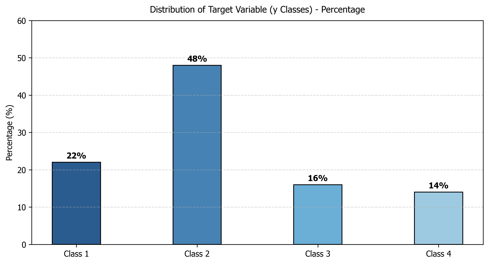
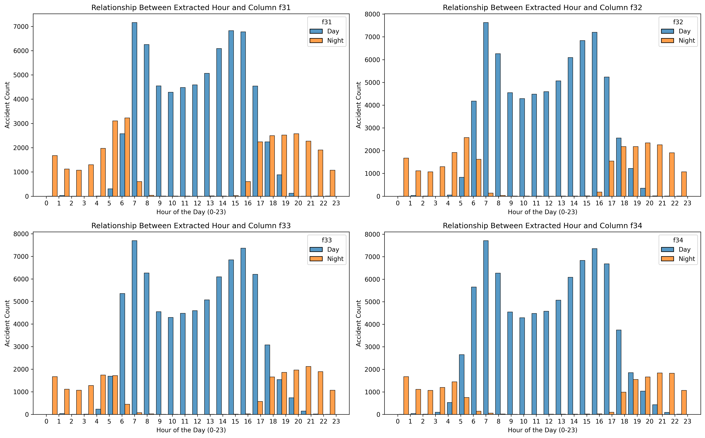

# گزارش پیشرفت: فاز ۲ پروژه 

## ۱. معرفی اولیه مجموعه‌داده و تعریف مسئله
مسئله پیش‌رو یک پروژه Multi-class Classification است که در آن هدف اصلی، پیش‌بینی صحیح کلاس متغیر هدف گسسته به نام y می‌باشد. این متغیر شامل ۴ کلاس مجزا (کلاس‌های ۱، ۲، ۳ و ۴) است که وضعیت نهایی یک رخداد ثبت‌شده در سامانه را توصیف می‌کند.

مجموعه‌داده ورودی شامل ویژگی‌هایی نام‌گذاری‌شده از قبیل f_1 تا f_34 است. تمام تحلیل‌های انجام‌شده در این مرحله صرفاً بر پایه رفتار ساختاری، آماری و محاسباتی خود داده‌ها استوار است.

---

## ۲. بررسی اولیه داده‌ها و تحلیل اکتشافی (EDA)
برای شناخت ساختار توزیع ماتریس ویژگی‌ها و متغیر هدف، بررسی‌های آماری اولیه روی داده‌های خام صورت گرفت تا میزان توازن کلاس‌ها و کیفیت داده‌های عددی ورودی ارزیابی شود.

### الف) توزیع متغیر هدف (y)
بررسی توزیع کلاس‌های چهارگانه نشان می‌دهد که مجموعه‌داده دچار چالش Class Imbalance است. بیش از ۴۵ درصد از نمونه‌ها به یک کلاس خاص اختصاص دارند، در حالی که دسته‌های ۳ و ۴ کمترین سهم از فراوانی را دارا هستند. این عدم توازن نقشی تعیین‌کننده در فازهای بعدی ایفا خواهد کرد؛ چرا که مدل‌های آماری به طور طبیعی تمایل دارند به سمت کلاس اکثریت سوگیری داشته باشند.

### ب) تحلیل نرخ داده‌های مفقود (Missing Values)
پیش از آغاز هرگونه فرآیند اصلاح، یک ارزیابی ساختاری روی درصد فیلدهای پوچ (Null) در تمامی ویژگی‌ها انجام شد. نتایج آماری نشان داد که توزیع داده‌های مفقود در سراسر ماتریس به هیچ وجه یکنواخت نیست. بخش بزرگی از مجموعه‌داده در سلامت کامل عددی قرار دارد، در حالی که چند ستون متمایز، نرخ گمشدگی بسیار بحرانی و بالای ۷۰ درصد را ثبت کرده‌اند که فرآیند تصمیم‌گیری آماری درباره آن‌ها در بخش پیش‌پدازش مستند شده است.

---

## ۳. کارهای انجام‌شده در زمینه پاک‌سازی و پیش‌پیش‌پردازش داده‌ها
بر اساس خروجی‌های به‌دست آمده از بخش تحلیل اکتشافی، یک Pipeline پیش‌پردازش متمرکز و چندمرحله‌ای طراحی و روی ماتریس ویژگی‌ها اعمال شد تا سازگاری داده‌ها با معیارهای ریاضی یادگیری ماشین تضمین شود:

*   **حذف ردیف‌های تکراری:** ردیف‌های کاملاً مشابه و همسان که فاقد هرگونه ارزش اطلاعاتی جدید بوده و صرفاً باعث Overfitting روی نمونه‌های خاص می‌شدند، شناسایی و در اولین گام از مجموعه داده حذف شدند.
*   **حذف ستون‌های با نرخ گمشدگی بالا:** ستون‌های عددی f_5, f_14, f_20 به دلیل دارا بودن نرخ مفقودی بسیار بالا و ثبت فیلدهای پوچ بالای ۷۰٪، به‌طور کامل از ماتریس ویژگی‌ها کنار گذاشته شدند. از آنجا که حجم اطلاعات موجود در این ستون‌ها ناچیز بود، هرگونه تلاش برای بازسازی یا Imputation داده‌ها منجر به تزریق نویز شدید و سوگیری‌های مصنوعی در الگوریتم می‌شد.
*   **جایگذاری مقادیر مفقود:** در سایر ستون‌های عددی باقی‌مانده که نرخ داده‌های گمشده آن‌ها بسیار ناچیز و در حد چند درصد بود، راهبرد جایگذاری با Mean همان ستون اعمال شد تا ساختار ابعادی ردیف‌ها و حجم کلی نمونه‌های در دسترس حفظ شود.
*   **حذف ویژگی‌های متنی و ثابت:** ستون‌های عددی f_7, f_8, f_11 از Pipeline محاسباتی کنار گذاشته شدند. دلیل حذف این ویژگی‌ها، دارا بودن مقادیر متنی غیرساختاریافته و یا داشتن واریانس نزدیک به صفر (ثابت بودن مقادیر در تمام نمونه‌ها) بود؛ ویژگی‌های بدون واریانس توانایی تفکیک‌کنندگی ندارند و نگهداری آن‌ها تنها باعث افزایش بیهوده ابعاد مسئله می‌شود.
*   **نحوه حذف ستون‌های شرایط زمانی دوگانه:** 
    ستون‌های پایانی مجموعه‌داده شامل f_31, f_32, f_33, f_34 که مربوط به موقعیت‌های زمانی شب و روز در شرایط مختلف بودند، به‌طور کامل حذف شدند. با بررسی ماتریس همبستگی مشخص شد که این چهار ستون Multicollinearity شدید و تداخل اطلاعاتی کاملی با سایر ویژگی‌های زمانی دارند؛ بنابراین برای جلوگیری از افزونگی داده‌ها و کاهش ابعاد غیرضروری، از Pipeline پردازش کنار گذاشته شدند.

---

## ۴. مشکلات و ابهامات
*   **محدودیت تحلیل شهودی:** پنهان بودن ماهیت ستون‌ها از f_1 تا f_34 امکان مهندسی ویژگی‌های کیفی مبتنی بر منطق یا ترکیب شهودی ستون‌ها را سلب کرده است. این امر ما را ناچار می‌سازد تا در مراحل پردازشی کاملاً به روش‌های تغییرات ریاضی، تحلیل‌های آماری پیشرفته و روش‌های خودکار کاهش ابعاد متکی بمانیم.
*   **چالش عدم تقارن داده‌ها:** وجود چالش عدم تعادل شدید در متغیر هدف به این معنی است که الگوهای مربوط به کلاس‌های ۳ و ۴ بسیار کمتر در دسترس هستند. این توزیع نامتوازن به عنوان یکی از چالش‌های اصلی ساختاری داده‌های ورودی ثبت شد که در طراحی Pipelineهای بعدی باید مستقیماً مدیریت شود.

